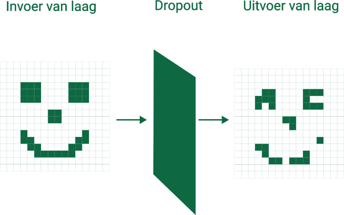

# Dropout

De **dropout** laag zal elk element in de invoer met een kans van \\(p\\) op nul zetten. Hieronder zie je een voorbeeld van hoe het effect van de dropout laag eruit kan zien.

Er zijn verschillende redenen waarom je dropout toepast.

- **Beschermt tegen overfitting**: Omdat je tijdens het trainen telkens andere willekeurige pixels op nul zet, zal het moeilijker zijn voor het netwerk om de trainingsverzameling van buiten te leren. Het gaat dus overfitting tegen.
- **Redundantie in geleerde eigenschappen**: Omdat je telkens ander pixels weglaat, zal het netwerk meerdere manieren moeten leren om bepaalde eigenschappen te herkennen. Je creëert als het ware "backup redeneringen" om bepaalde objecten te herkennen.
- **Model generaliseert beter**: Dropout introduceert willekeurige variaties in de invoerafbeeldingen. Daardoor kan het getrainde netwerk beter omgaan met afbeeldingen die het nog niet gezien heeft. 

<h2 class="title">Dropout</h2>

Dropout wordt enkel toegepast tijdens het trainen van het netwerk. Eens het netwerk getraind is, zal deze laag geen waarden meer op nul zetten. 

