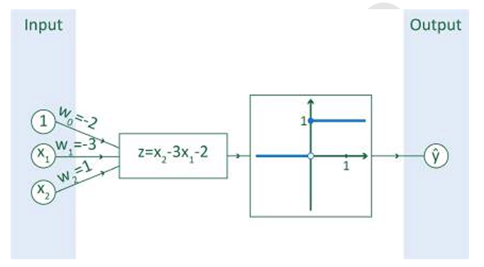

# Dense lagen

Dense lagen, anders gezegd fully connected layers, zijn lagen waarin alle elementen in deze laag via neuronen verbonden zijn met alle elementen in de volgende laag. Voor elk element in de volgende laag wordt een gewogen som genomen van de elementen in de huidige laag, daarna wordt een activatiefunctie toegepast op het resultaat van de som (bv. relu). Hieronder zie je een voorbeeld van zo'n dense laag met drie invoerwaarden en één uitvoerwaarde.

