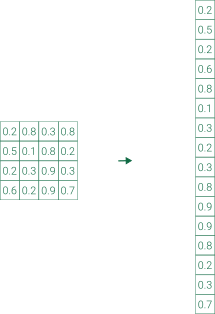

# Flatten

Voordat deze data als invoer van de dense layers kunnen dienen, moet de 2D-afbeelding worden omgezet in een kolommatrix. Dit gebeurt door een <b>flatten</b>-operatie. Onderstaande figuur toont hoe de flatten-operatie een afbeelding omzet in een kolommatrix om als invoer te dienen voor de dense layers.

