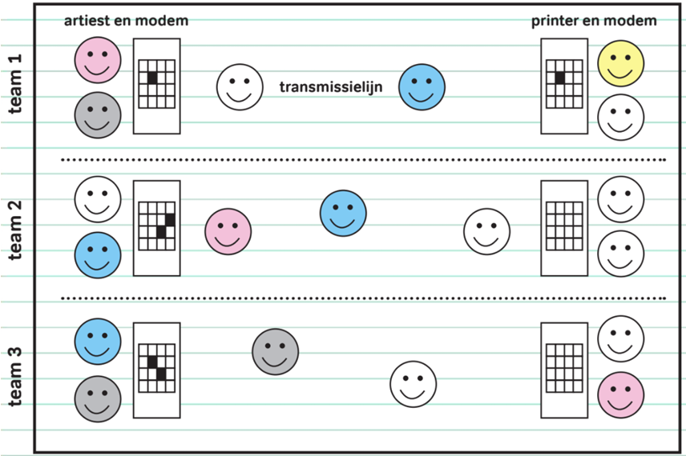

# Verloop

Verdeel de deelnemers in groepjes van 5 à 7. Geef iedere groep twee blanco rasters en twee potloden. Per groep is er een rolverdeling:
* Eén artiest die een tekening maakt op het blanco raster.
* Eén printer die later in het spel een tekening die via het ‘netwerk’ verstuurd werd, reconstrueert.
* Twee assistenten doen dienst als modem en helpen ofwel de artiest, ofwel de printer.
* De andere jongeren zullen boodschappen in het netwerk overbrengen.

Zet de jongeren per groep samen en laat de artiest een tekening maken. De tekening wordt gemaakt door de gewenste hokjes op het blanco raster in te kleuren. Zorg ervoor dat de andere groepen de tekening niet zien.

Wanneer de tekening klaar is, vraag je aan iedere groep om een manier te bedenken, een protocol, waarmee ze een getekende figuur kunnen voorstellen door middel van natuurlijke getallen, en hoe ze deze getallen één per één zullen verzenden via het netwerk van artiest naar printer. Het verzenden gebeurt door kinderen die van de ene kant naar de andere kant lopen. De bedoeling is dat de printer de tekening van de artiest kan printen zonder dat de printer de tekening gezien heeft.

Het is belangrijk om goed te verduidelijken wat een natuurlijk getal is en dat er slechts één getal per keer doorgegeven mag worden. Met andere woorden, één getal komt overeen met één keer lopen, én deindividuele cijfers van deze getallen kunnen niet afzonderlijk gespeld worden!

Haal de tekeningen nu op en stel de groepen als volgt op: Zet de artiesten met hun modulator aan één kant van de ruimte. Zet de printers samen met hun modem aan de andere kant van de ruimte. De andere kinderen zullen heen en weer lopen tussen artiest en printer.

De indeling van de ruimte kan je bekijken op de afbeelding.

Verspreid nu de tekeningen willekeurig over de artiesten, maar zorg ervoor dat geen enkele groep zijn eigen tekening krijgt.

Geef vervolgens het startsignaal waarop het versturen kan beginnen!

Wanneer een groep klaar is, geven ze beide tekeningen af (het origineel en de print).