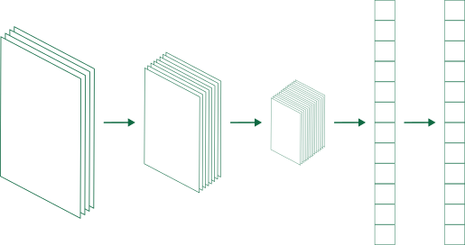
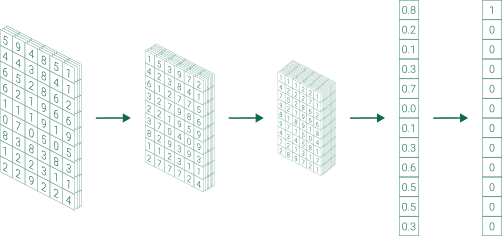
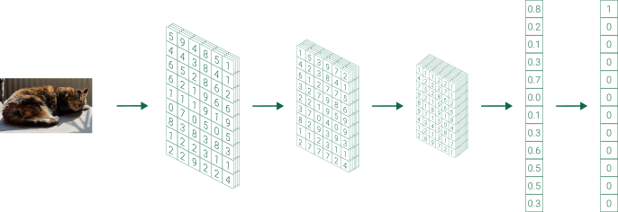
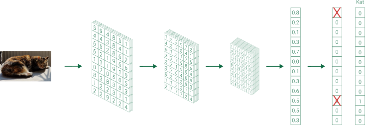
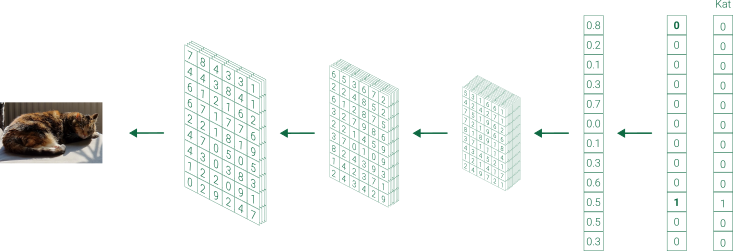

# AI-model

Op de pagina van Teachable Machine, zie je twee knoppen die verwijzen naar een **"model"**. De knoppen hebben respectievelijk de namen **Model trainen** en **Model exporteren**. **Wat is dat nu eigenlijk, een model?**

Een **AI-model** is een verzamelnaam voor verschillende soorten informatie die nodig zijn om het AI-systeem te doen werken. Het model bestaat uit **een datastructuur, algoritmes voor de evaluatie en de geleerde parameters (de gewichten)**. Hieronder lichten we die verschillende concepten toe:

* **De datastructuur**: De datastructuur legt de vorm van het model vast. Er zijn verschillende soorten AI-modellen, allemaal met hun eigen structuur. Een neuraal netwerk bestaat bijvoorbeeld uit een aantal lagen met verbindingen ertussen. Er bestaan ook andere AI-modellen bijvoorbeeld random forests, zo'n model bestaat niet uit lagen maar wel uit een verzameling van bomen.
* **De geleerde parameters**: In de datastructuur van het model kunnen we waarden invullen. Meestal zijn dit gewoon getallen. Het trainingsalgoritme zal ervoor zorgen dat de waarden zodanig ingevuld worden dat je het model kan gebruiken om voorspellingen mee te doen.
* **Algoritmes**: Er zijn verschillende algoritmes nodig om met een model te kunnen werken. Er zal een algoritme nodig zijn om het model iets te "leren" maar ook om het model een voorspelling te laten doen. Een bekend algoritme dat we gebruiken om neurale netwerken iets te leren is **backpropagation**. Het gebruikte algoritme hangt sterk samen met de gekozen datastructuur.

## Datastructuur, paremeters en algoritmes

Hieronder leggen we visueel uit wat de datastructuur, de parameters en het algoritme van een neuraal netwerk zijn.

### Datastructuur

Op onderstaande figuur zie je een voorbeeld van een neuraal netwerk. 

Je ziet dat het neurale netwerk opgebouwd is uit verschillende lagen. Hier worden die lagen van links naar rechts weergegeven. De eerste laag noemen we de invoerlaag (input layer). Deze zal de grootte hebben van onze invoerdata. Bijvoorbeeld een afbeelding van 220x220 pixels. De laatste laag heet de uitvoerlaag (output layer). Deze zal de voorspelling van het netwerk bevatten. Alle lagen daartussen noemen we de verborgen lagen (hidden layers). Het formaat van zowel de invoer-, verborgen- als uitvoerlagen kan sterk verschillen van neuraal netwerk tot neuraal netwerk. Ook het aantal verborgen lagen verschilt tussen verschillende neurale netwerken.

### Parameters (ofwel gewichten)

In de lagen slaan we getallen op. Deze getallen noemen we de gewichten (weights) van het neurale netwerk. Deze getallen bepalen ook het gedrag van het netwerk. Wanneer we een netwerk trainen, passen we deze getallen beetje bij beetje aan tot ze de juiste waarde hebben. Dat is zo wanneer het neurale netwerk goed is in juiste voorspellingen doen. Wat "goed" is, bepalen we zelf. Een systeem die katten en honden moet kunnen onderscheiden kunnen we bijvoorbeeld als "goed" bestempelen wanneer het 99% van de tijd een correcte voorspelling doet.

Hieronder zie je een neuraal netwerk waarin de gewichten een waarde gekregen hebben. Merk op dat de laatste laag getallen tussen 0 en 1 bevat. Dit is de kans dat de afbeelding die je toonde, tot een bepaalde categorie behoort. Het eerste element in de kolom is bijvoorbeeld de kans dat er een hond op de afbeelding staat, het tweede element de kans dat het een schildpad is, het derde de kans dat het een leeuw is, ...

### Algoritme

Er zijn verschillende algoritmes nodig om het neuraal netwerk te doen werken. Een eerste is om een afbeelding te *evalueren*. Dit algoritme zal de lagen met elkaar "verbinden" door 

