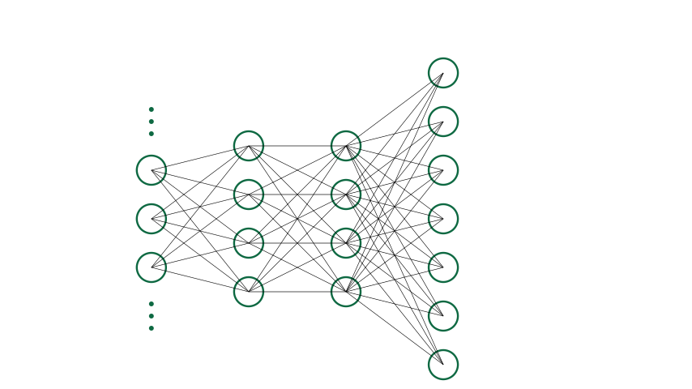
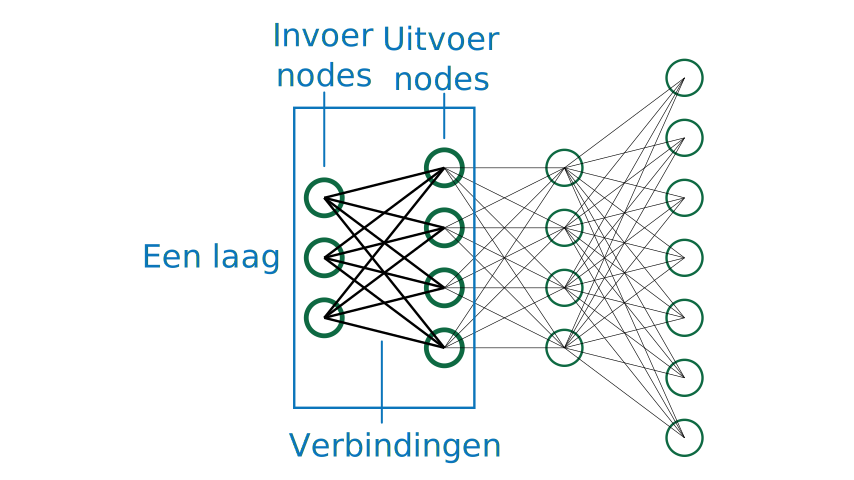
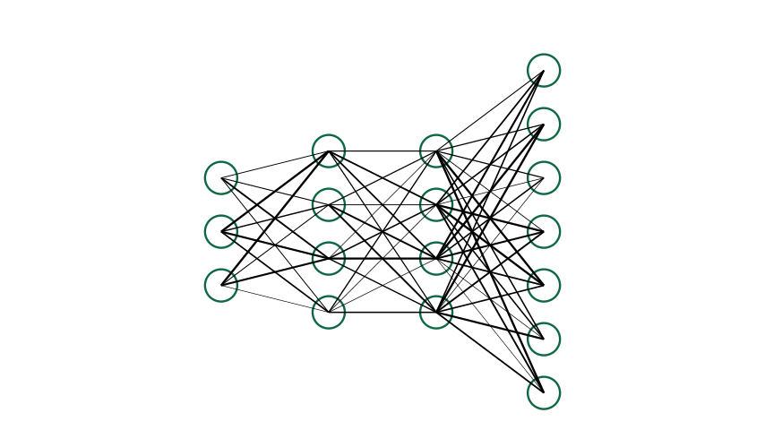

# AI-model

Op de pagina van Teachable Machine, zie je twee knoppen die verwijzen naar een **"model"**. Welke knoppen zijn dat? Zoek ze in de op de pagina van de Teachable machine. **Wat is dat nu eigenlijk, een model?**

Een **AI-model** is een verzamelnaam voor verschillende soorten informatie die nodig zijn om het AI-systeem te doen werken. Het model bestaat uit **een architectuur, algoritmes voor trainen en evaluatie en de geleerde parameters (de gewichten)**. Hieronder lichten we die verschillende concepten toe:

* **De architectuur**: De architectuur legt de vorm van het model vast. Er zijn verschillende soorten AI-modellen, allemaal met hun eigen structuur. Een neuraal netwerk bestaat bijvoorbeeld uit een aantal lagen met elk hun eigen bewerking. Er bestaan ook andere AI-modellen bijvoorbeeld random forests, zo'n model bestaat niet uit lagen maar wel uit een verzameling van bomen.
* **De geleerde parameters**: Naast de structuur van het model (de architectuur), heeft het model ook waarden nodig waarop het zich kan baseren om een voorspelling te doen. Meestal zijn dit gewoon getallen. Het trainingsalgoritme zal ervoor zorgen dat de waarden zodanig ingevuld worden dat je het model kan gebruiken om voorspellingen mee te doen.
* **Algoritmes**: Er zijn verschillende algoritmes nodig om met een model te kunnen werken. Er zal een algoritme nodig zijn om het model iets te "leren" maar ook om het model een voorspelling te laten doen. Een bekend algoritme dat we gebruiken om neurale netwerken iets te leren is **backpropagation**. Het gebruikte algoritme hangt sterk samen met de gekozen datastructuur.

## Architectuur, paremeters en algoritmes

Hieronder leggen we visueel uit wat de architectuur, de parameters en het algoritme van een neuraal netwerk zijn.

### Architectuur

Op onderstaande figuur zie je een voorbeeld van een neuraal netwerk. 

Je ziet dat het neurale netwerk opgebouwd is uit verschillende lagen. Hier worden die lagen van links naar rechts weergegeven. De invoer van de eerste laag zal de grootte hebben van onze invoerdata. Bijvoorbeeld een afbeelding van 220x220 pixels. De uitvoer van de laatste laag zal de voorspelling van het netwerk bevatten. Alle lagen daartussen noemen we de verborgen lagen (hidden layers). De vorm van zowel de invoer-, verborgen- als uitvoerlagen kan sterk verschillen van neuraal netwerk tot neuraal netwerk. Ook het aantal verborgen lagen verschilt tussen verschillende neurale netwerken.

Een **laag** bestaat uit een invoer, een verwerking en een uitvoer. De invoer komt van de nodes links in de laag. De verwerking gebeurd op basis van de sterkte van de verbindingen in de laag (de gewichten) en een wiskundige formule. De uitvoer wordt geschreven naar de nodes rechts van de laag. 

### Parameters (ofwel gewichten)

In de lagen slaan we getallen op. Deze getallen noemen we de gewichten (weights) van het neurale netwerk. Deze getallen bepalen ook het gedrag van het netwerk. Wanneer we een netwerk trainen, passen we deze getallen beetje bij beetje aan tot ze de juiste waarde hebben. Dat is zo wanneer het neurale netwerk goed is in juiste voorspellingen doen. Wat "goed" is, bepalen we zelf. Een systeem die katten en honden moet kunnen onderscheiden kunnen we bijvoorbeeld als "goed" bestempelen wanneer het 99% van de tijd een correcte voorspelling doet.

Hieronder zie je een neuraal netwerk waarin de gewichten een waarde gekregen hebben. Hoe dikker de verbindingslijn, hoe groter het gewicht dus meer invloed het heeft in de berekening.

### Algoritme

Er zijn verschillende algoritmes nodig om het neuraal netwerk te doen werken. Hier is het vooral belangrijk dat je weet dat er altijd twee soorten algoritmes nodig zijn: een **trainingsalgoritme** en een **inference-** ofwel **evaluatiealgoritme**.

Het **trainingsalgoritme** zal de gewichten in het netwerk aanpassen op basis van voorbeelddata.

Het **evaluatiealgoritme** zal een voorspelling doen voor een nieuwe afbeelding.

    <h2 class="title">Algoritmische overlap</h2>
    

        Bij veel AI-systemen zoals neurale netwerken is het evaluatiealgoritme een onderdeel van het trainingsalgoritme. Dat komt omdat je bij het trainen moet weten hoe goed het model al werkt. Daarvoor zijn dus tussentijdse evaluaties nodig.
    

