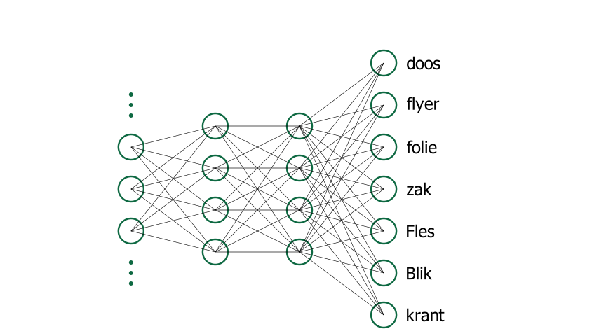
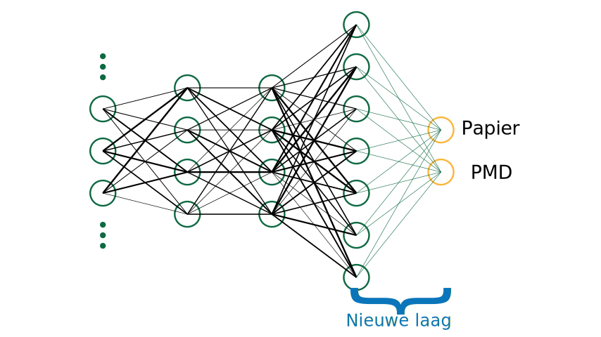

# Transfer learning

*Transfer learning* ofwel 'transfer leren', is een techniek waarmee je de kracht van een bestaand AI-model kan gebruiken voor een nieuwe taak. Stel dat je een model wilt trainen dat afval kan indelen in de categorieën 'Papier' en 'PMD'.  
Je zou daarvoor kunnen starten vanaf nul en een volledig nieuw AI-model trainen. Hiervoor heb je echter heel wat data nodig: deze dataset zou duizenden afbeeldingen van papier en PMD moeten bevatten. Het zou dus veel werk zijn om deze afbeeldingen te verzamelen.  
Om dit te vermijden kan je vertrekken van een bestaand model dat al door iemand anders getraind is voor een gelijksoortige taak. Er zijn verschillende modellen (bv. ImageNet) die getraind zijn om objecten in afbeeldingen te detecteren. ImageNet is bijvoorbeeld getraind op meer dan een miljoen afbeeldingen en kan 1000 verschillende objecten classificeren. Door van dit model te vertrekken maar het aan te passen voor jouw taak, kan je tot een goed resultaat komen met een beperkt aantal afbeeldingen. Concreet houdt die aanpassing in dat je aan een bestaand model een extra laag toevoegt en het model vervolgens bijtraint.

## Extra laag

Concreet voeg je bij transfer learning een nieuwe laag toe aan een bestaand model. Vertrek bijvoorbeeld van het volgende model:

Zoals je ziet is het model getraind om objecten zoals een doos, een fles, een zak, enz. te classificeren. Je voegt nu een extra laag toe aan dit model. Deze laag zal je trainen om de vertaling te maken van objecttype naar afvalcategorie. Je zal er dus voor zorgen dat het model kan voorspellen tot welke afvalcategorie een object behoort.

