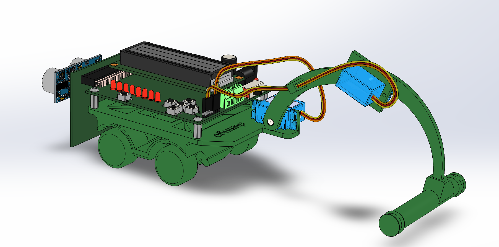
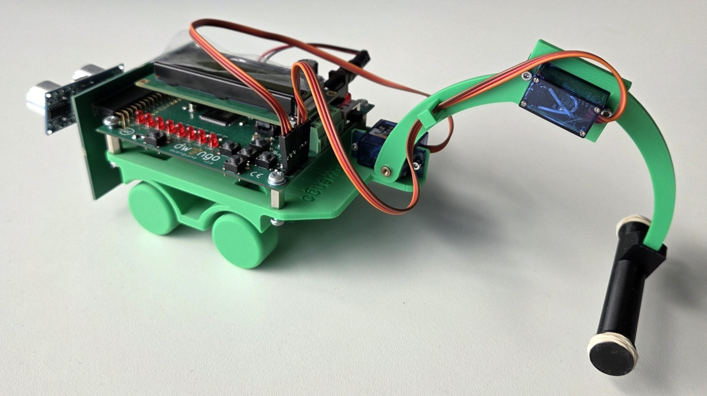

# Het mechanisch ontwerp

Het lichaam van de robot bestaat uit de volgende onderdelen:

- het Dwenguino bord;
- het 'sociale robot' uitbreidingsbord;
- twee 180° servomotoren;
- een 9V batterij;
- een kabeltje om de 9V batterij te verbinden met het Dwenguino bord;
- een wagentje;
- vier M3 boutjes van lengte 1cm;
- vier M2 boutjes met moer van lengte 1cm;
- een arm, deze bestaat uit een bovenarm, een onderarm en een schep.
- Twee elastieken.

Hieronder zie je een render en een foto van de geassembleerde robot. 

Voor je de robot kan bouwen, zal je een aantal onderdelen moeten 3D-printen. In de volgende stap van dit leerpad geven we daar meer informatie over.