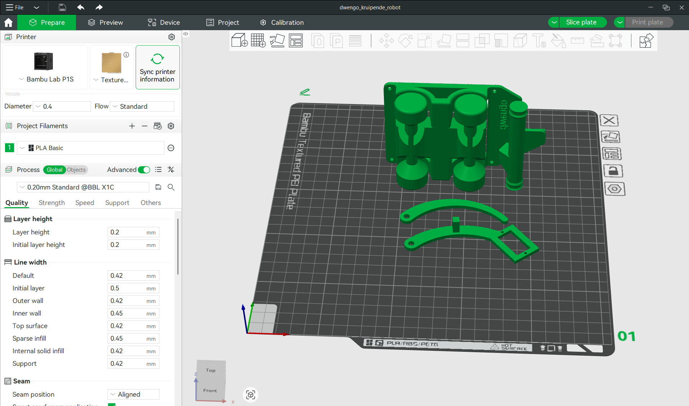

# 3D-printen

Voor we de robot kunnen bouwen, moeten we een aantal onderdelen 3D-printen. Hieronder geven we een overzicht van die onderdelen. Je kan bij elk onderdeel verschillende bestanden terugvinden.

1. Een .STEP bestand. Dit bestand kan je openen in de meeste 3D-printer software. Het bevat de informatie die nodig is om het 3D-ontwerp te printen.
2. Een .STL bestand. Vroeger maakte 3D-printer software meestal gebruik van .STL bestanden. Mocht je printer dus geen .STEP bestanden ondersteunen dan kan je het .STL bestand gebruiken.
3. Een .SLDPRT bestand. Dit het het bronbestand van het 3D-ontwerp dat gemaakt werd in Solidworks. Als je Solidworks hebt en ermee kan werken, kan je het ontwerp zelf aanpassen naar je eigen noden.

Hieronder vind je de te printen bestanden.

- Het wagentje ([.STEP](./final_designs/dwengo_kruipende_robot_wielen.STEP), [.STL](./final_designs/dwengo_kruipende_robot_wielen.STL), [.SLDPRT](final_designs/dwengo_kruipende_robot_wielen.SLDPRT)).
- Het eerste deel van de arm met plaats voor een servo motor ([.STEP](final_designs/servo_arm_met_servo.STEP), [.STL](./final_designs/servo_arm_met_servo.STL), [.SLDPRT](final_designs/servo_arm_met_servo.SLDPRT)).
- Het tweede deel van de arm ([.STEP](./final_designs/servo_arm_foot.STEP), [.STL](./final_designs/servo_arm_foot.STL), [.SLDPRT](final_designs/servo_arm_foot.SLDPRT)).
- De roller die zorgt voor meer grip op de grond ([.STEP](./final_designs/servo_arm_roller.STEP), [.STL](./final_designs/servo_arm_roller.STL), [.SLDPRT](final_designs/servo_arm_roller.SLDPRT)).

## Je 3D-printer software

Afhankelijk van de printer die je ter beschikking hebt, zal het printproces iets anders verlopen. Toch volgt de meeste software min of meer dezelfde stappen.

1. Voeg de onderdelen die je wil printen toe aan de bouwplaat in het programma.
2. Kies de correcte instellingen voor je print (bv. het filament dat je gebruikt en de printkwaliteit). De meeste software heeft tegenwoordig verschillende standaardprofielen waaruit je kan kiezen zodat je niet alle instellingen individueel moet aanpassen. Als je software zo'n profiel heeft, kies dan voor een print van standaard kwaliteit. 
3. Zet het 3D-ontwerp om in een pad dat de kop van de 3D-printer zal volgen. Deze stap noemen ze ook wel het *slicen* van het model.
4. Zet het *geslicete* bestand over naar de printer. Op sommige printers kan dat via wifi. Bij andere printers zal je de SD-kaart uit de printer moeten nemen, je bestand erop zetten, en dan de SD-kaart terug in de printer steken.
5. Start de print en wacht.

Wij hebben dit ontwerp geprint met een Bambu Labs printer. Hieronder zie je een schermafbeelding van onze slicer software.

<h2 class="title">Slicen</h2>

Het programma van je 3D-printer wordt ook wel eens de <em>slicer</em> genoemd. Dit komt van het Engelse werkwoord <em>to slice</em> (snijden in het Nederlands). De applicatie is daarnaar vernoemd omdat het je 3D-model in laagjes zal snijden en voor elk laagje een pad voor de kop van de 3D-printer zal berekenen. 

<h2 class="title">Opdracht</h2>

Print alle onderdelen van de kruipende robot op een 3D-printer.

