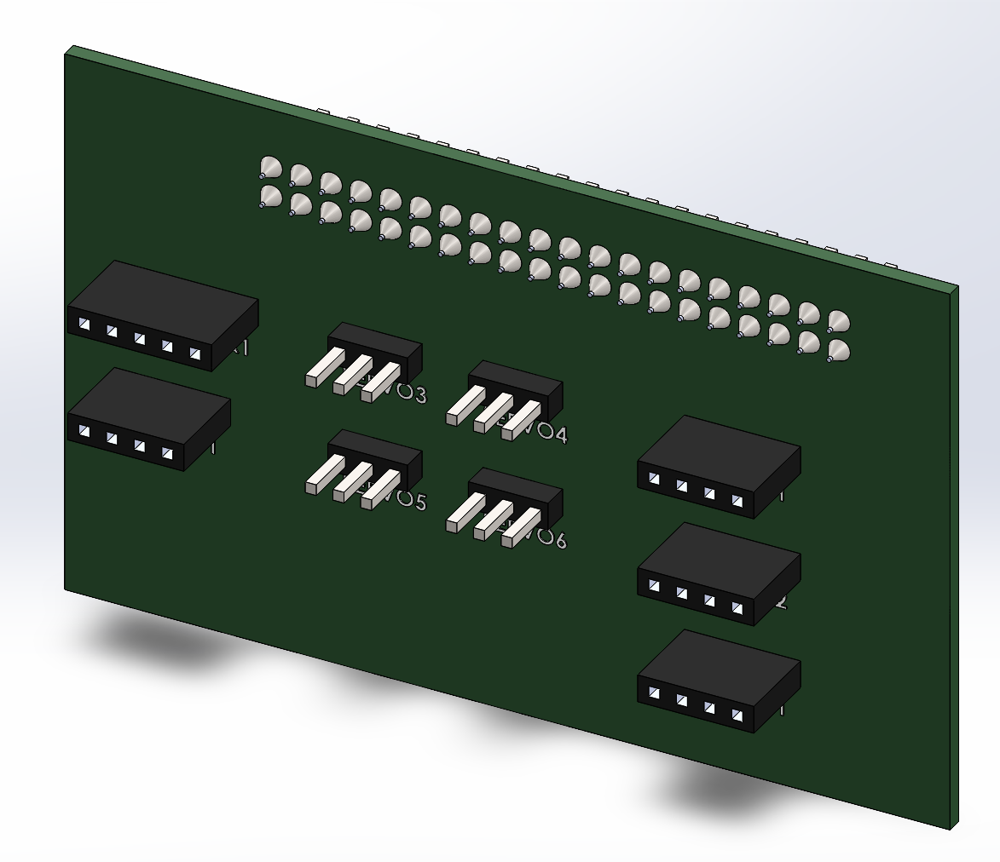
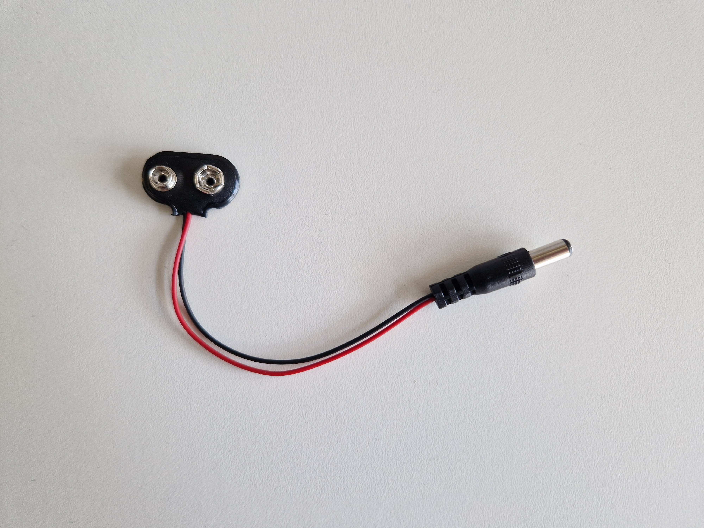
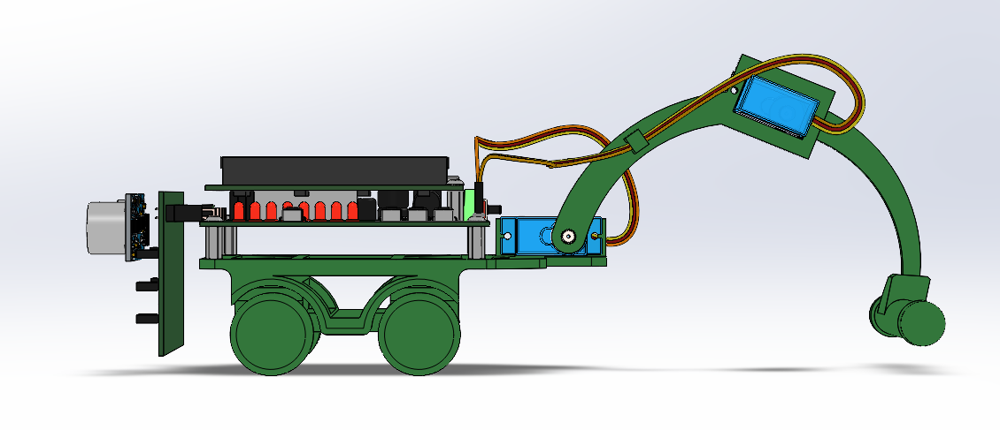

# Elektronica

Alle elektronica die je voor deze robot nodig hebt kan je vinden in de 'sociale robot'-kit van Dwengo. Je kan die ontlenen via je scholenkoepel (vraag daarvoor meer info aan de pedagogische begeleidingsdienst) of aankopen via [dwengo.org/shop](dwengo.org/shop). Voor de kruipende robot hebben we de volgende elektronica nodig.

<table>
<tr><td></td><td>Twee FS90MG micro servomotoren.</td></tr>
<tr><td></td><td>Eén HC-SR04 sonarsensor.</td></tr>
<tr><td></td><td>Het Dwenguino microcontrollerplatform.</td></tr>
<tr><td></td><td>Het sociale robot uitbreidingsbord.</td></tr>
</table>

Wil je graag dat je robot autonoom kan rijden zonder verbonden te moeten zijn met de computer, dan hebt je een 9V batterij nodig en een kabeltje om die batterij te verbinden met te 5mm jack van de Dwenguino.

De aansluiting van de elektronica is relatief eenvoudig. De servos kan je verbinden met de SERVO1 en SERVO2 connectoren op het Dwenguino bord. De sonarsensor kan je verbinden met de SONAR1 connector op het uitbreidingsbord. Je zal de pinnen van de sonar 90 graden moeten buigen zodat de sensor niet naar de grond kijkt.

<h2 class="title">Opdracht</h2>

Assembleer de robot. Gebruik daarvoor de opgelijste elektronica en de onderdelen die je ge-3D-print hebt. Als je een 9V batterij gebruikt, zorg dan dat je die in de behuizing steekt voordat je de Dwenguino eraan bevestigt.

