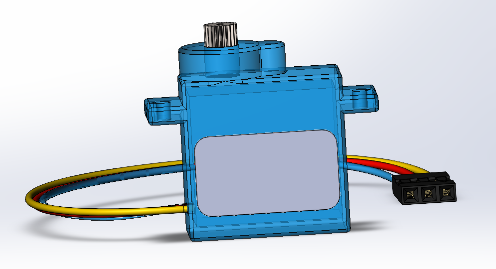
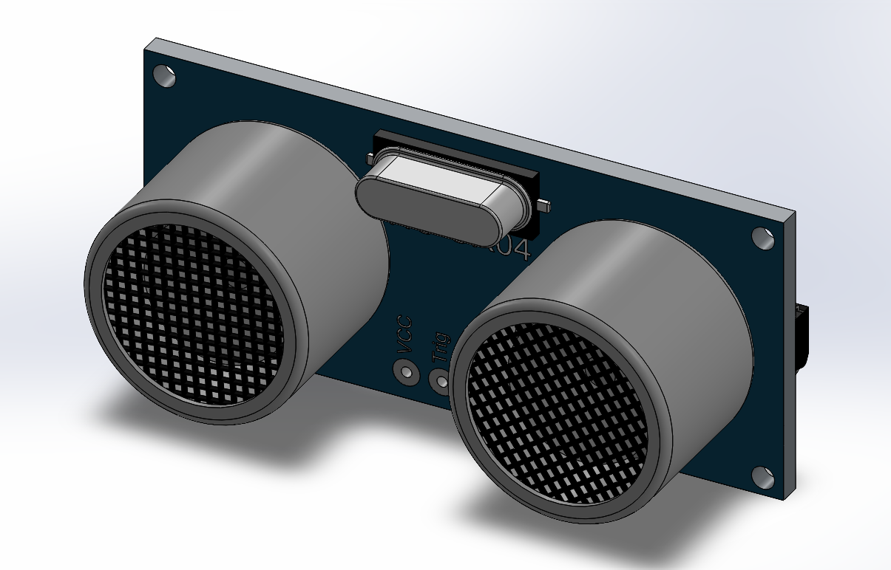
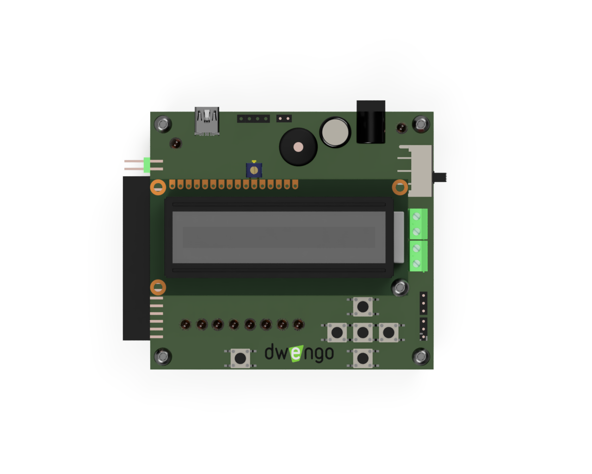
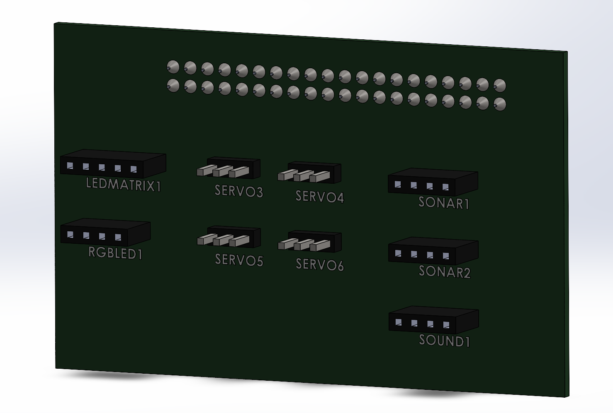

# Elektronica

Alle elektronica die je voor deze robot nodig hebt kan je vinden in de 'sociale robot'-kit van Dwengo. Je kan die ontlenen via je scholenkoepel (vraag daarvoor meer info aan de pedagogische begeleidingsdienst) of aankopen via [dwengo.org/shop](dwengo.org/shop). Voor de kruipende robot hebben we de volgende elektronica nodig.

<table>
<tr><td></td><td>De servo</td></tr>
<tr><td></td><td>De sonar</td></tr>
<tr><td></td><td>De Dwenguino</td></tr>
<tr><td></td><td>Het sociale robot uitbreidingsbord</td></tr>
</table>

Wil je graag dat je robot autonoom kan rijden zonder verbonden te moeten zijn met de computer, dan hebt je een 9V batterij nodig en een kabeltje om die batterij te verbinden met te 5mm jack van de Dwenguino.