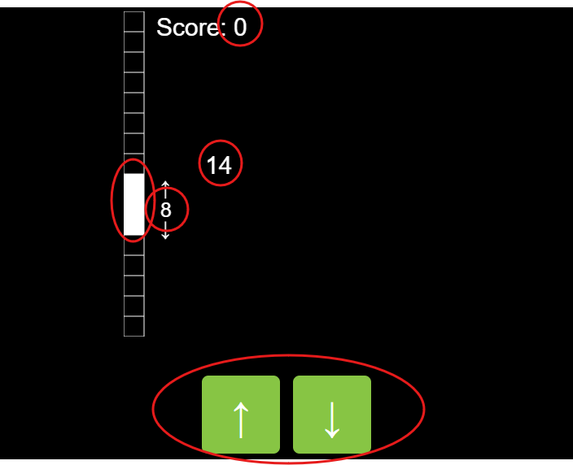
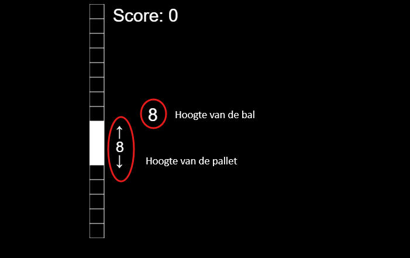

# De omgeving en de toestand

## De omgeving

De omgeving kan je zien als de wereld waarin de agent zich kan bewegen. De wereld van een hamster is bijvoorbeeld alles wat er zich in zijn kooi bevindt. In ons spel bestaat de omgeving uit de score bovenaan, de drie blokjes (het 'palet') aan de linkerkant, de twee cijfers en de knoppen onderaan. Op deze foto zie je wat de elementen zijn van de omgeving van ons spel.

## De toestand

Een omgeving heeft ook altijd een **toestand**. De toestand van de omgeving is een momentopname van hoe de omgeving er op dat moment uitziet. In de hamsterkooi kan de toestand bijvoorbeeld zijn dat al het stro aan de rechterkant van de kooi ligt, de kom met eten leeg is en de hamsterkeutels overal verspreid liggen. Op een ander moment, bijvoorbeeld nadat je de kooi hebt uitgekuist, kan de toestand helemaal anders zijn: het stro ligt mooi verspreid, de kom met eten is vol en er liggen geen keutels in de kooi. 

In ons spel zijn er eigenlijk maar twee waarden die de toestand van het spel bepalen. De hoogte van het palet en de hoogte van de bal. De score is hier niet echt deel van de toestand. Het geeft enkel weer hoeveel beloning we tot dan toe hebben gekregen.

Merk op dat je enkel deze twee waarden nodig had om te leren hoe je het spel kon spelen. Pas later in het spel, toen je meer dan 150 punten haalde, kon je zien dat je eigenlijk pong aan het spelen was. Dit toont aan dat je kan leren om pong te spelen door enkel te kijken naar de hoogte van je palet en de hoogte van de bal.