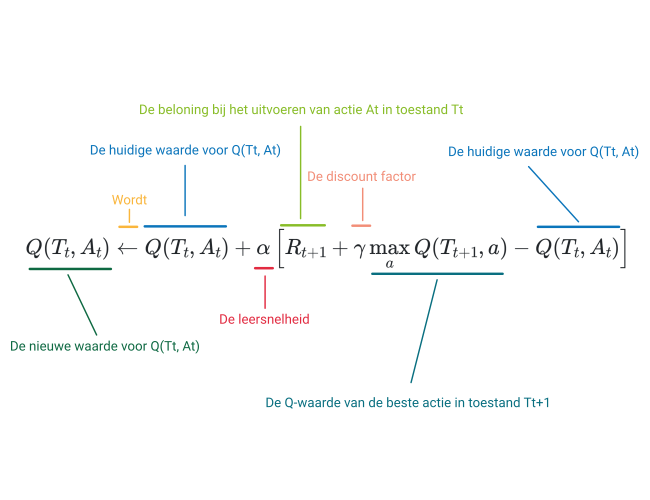

# Q-learning

Er zijn heel wat verschillende technieken om op zoek te gaan naar een optimaal beleid. In de rest van dit leerpad focussen we op **Q-learning**. Bij Q-learning gaan we op zoek naar een **waardefunctie** \\(Q\\) die de optimale waardefunctie voor een probleem zal benaderen. \\(Q\\) zegt ons voor elke combinatie van een **toestand** en een **actie** hoe goed die actie is in die toestand. Schrijven we dat met een formule, dan ziet die er als volgt uit.

\\[
    Q(T_t, A_t)=\mathrm{Hoe\ goed\ is\ actie\ }A_t\mathrm{\ in\ toestand\ }T_t
\\]

Hierbij zijn \\(T_t\\) en \\(A_t\\) de toestand en de actie op tijdstip \\(t\\).

Deze functie \\(Q(T_t, A_t)\\) leren we door acties uit te proberen en de functie aan te passen op basis van de beloning die we kregen voor een actie. Om die functie te kunnen aanpassen, leggen we een upate-regel vast.

## De update regel

Hieronder geven we eerst de formule waarmee we \\(Q(T_t, A_t)\\) zullen aanpassen telkens we een beloning hebben gekregen. Laat je niet overweldigen door de formule. We leggen die verder in het leerpad stap voor stap uit. 

\\[
  Q(T_t, A_t) \leftarrow Q(T_t, A_t) + \alpha  \left[ R_{t+1} + \gamma \max_{a} Q(T_{t+1}, a) - Q(T_t, A_t) \right]
\\]

* De pijl \\(\leftarrow\\) geeft aan dat we een nieuwe waarde toekennen aan \\(Q(T_t, A_t)\\).
* Deze nieuwe waarde is de huidige waarde (\\(Q(T_t, A_t)\\)) plus een correctiewaarde (\\(\alpha  \left[ R_{t+1} + \gamma \max_{a} Q(T_{t+1}, a) - Q(T_t, A_t) \right]\\)).
* De correctiewaarde bestaat uit de volgende elementen:
  - \\(\alpha\\): Een getal tussen 0 en 1 dat beïnvloed hoe sterk we de Q-functie zullen aanpassen. \\(\alpha\\) noemen we de leersnelheid.
  - \\(R_{t+1}\\): De beloning die de agent krijgt op tijdstip \\(t\\) na het uitvoeren van actie \\(A_t\\).
  - \\(\gamma \\): Een getal tussen 0 en 1 dat beïnvloed hoe sterk dat de toekomstige beloning de huidige beloning zal beïnvloeden. \\(\gamma\\) noemen we de *discount factor*.
  - \\(\max_{a} Q(T_{t+1}, a)\\): De Q-waarde van de beste actie \\(a\\) in toestand \\(T_{t+1}\\) maal een wegingsfactor \\(\gamma\\).
  - \\(Q(T_t, A_t)\\): De huidige Q-waarde in toestand \\(T_t\\) bij het uitvoeren van actie \\(A_t\\).

  Hieronder zie je nog eens een overzicht van de verschillende componenten in de formule.

  

  

