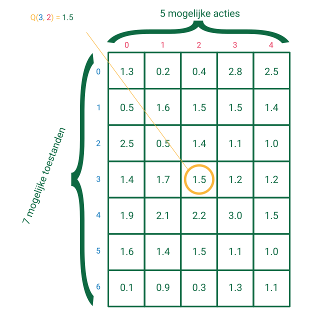

# De Q-tabel

De waardefunctie \((Q(T_t, A_t)\)) zegt ons hoe goed actie \\(A_t\\) is in toestand \\(T_t\\). Er zijn verschillende manieren om deze \\(Q\\)-functie voor te stellen. Een van de eenvoudigste manieren is aan de hand van een tabel. Voor elke mogelijk toestand in onze wereld voegen we een rij toe aan de tabel, voor elke mogelijke actie in de wereld voegen we een kolom toe. Op onderstaande figuur zie je een Q-tabel voor 5 acties en 7 toestanden. De waarde in de tabel zegt hoe goed de actie bovenaan de kolom is wanneer de agent in de toestand links van de rij zit.

 