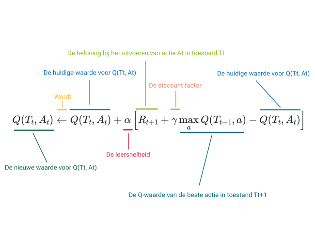

# De update regel

Je weet nu dat je de \\(Q\\) functie kan voorstellen aan de hand van een tabel. Met behulp van die tabel weet een agent hoe deze een beleid/policy moet uitvoeren. Bijvoorbeeld door in elke toestand de actie te kiezen met de hoogste waarde. De vraag is nu natuurlijk, hoe stellen we deze tabel op?

Om de Q-tabel op te stellen, laten we de agent acties uitproberen en kijken we welke beloning deze ervoor krijgt. Op basis van deze beloning passen we de waarde in de Q-tabel aan. Zo proberen we in elke toestand een betere inschatting te krijgen van de beloning die elke actie zal opleveren. 

## De update regel

Hieronder geven we eerst de formule waarmee we \\(Q(T_t, A_t)\\) zullen aanpassen telkens we een beloning hebben gekregen. Laat je niet overweldigen door de formule. We leggen die verder in het leerpad stap voor stap uit. 

\\[
  Q(T_t, A_t) \leftarrow Q(T_t, A_t) + \alpha  \left[ R_{t+1} + \gamma \max_{a} Q(T_{t+1}, a) - Q(T_t, A_t) \right]
\\]

* De pijl \\(\leftarrow\\) geeft aan dat we een nieuwe waarde toekennen aan \\(Q(T_t, A_t)\\).
* Deze nieuwe waarde is de huidige waarde (\\(Q(T_t, A_t)\\)) plus een correctiewaarde (\\(\alpha  \left[ R_{t+1} + \gamma \max_{a} Q(T_{t+1}, a) - Q(T_t, A_t) \right]\\)).
* De correctiewaarde bestaat uit de volgende elementen:
  - \\(\alpha\\): Een getal tussen 0 en 1 dat beïnvloed hoe sterk we de Q-functie zullen aanpassen. \\(\alpha\\) noemen we de leersnelheid.
  - \\(R_{t+1}\\): De beloning die de agent krijgt op tijdstip \\(t\\) na het uitvoeren van actie \\(A_t\\).
  - \\(\gamma \\): Een getal tussen 0 en 1 dat beïnvloed hoe sterk dat de toekomstige beloning de huidige beloning zal beïnvloeden. \\(\gamma\\) noemen we de *discount factor*.
  - \\(\max_{a} Q(T_{t+1}, a)\\): De Q-waarde van de beste actie \\(a\\) in toestand \\(T_{t+1}\\) maal een wegingsfactor \\(\gamma\\).
  - \\(Q(T_t, A_t)\\): De huidige Q-waarde in toestand \\(T_t\\) bij het uitvoeren van actie \\(A_t\\).

  Hieronder zie je nog eens een overzicht van de verschillende componenten in de formule.

  