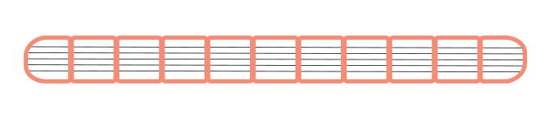
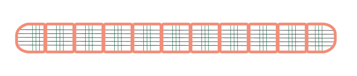
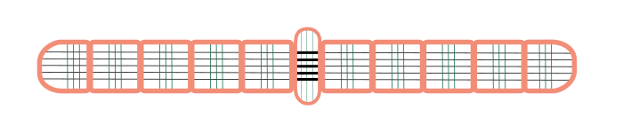
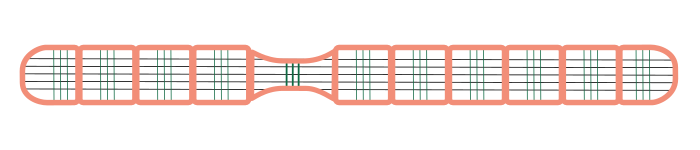

# De worm

Je weet nu hoe je de waardefunctie kan voorstellen aan de hand van een Q-tabel en hoe je de waarden in de Q-tabel kan aanpassen op basis van een beloning. Toch blijft dit wel behoorlijk abstract. Daarom gaan we hier aan de slag met een concreet voorbeeld. In dit voorbeeld zullen we een virtuele worm leren kruipen aan de hand van versterkend leren. 

## Hoe kruipt een worm?

Je bent zeker al eens een worm tegengekomen wanneer je aan het graven was in de tuin. Heb je dan al eens stilgestaan bij hoe zo'n worm zich verplaatst onder de grond? Dat is niet zo evident, wormen hebben immers geen poten. Beeld je in dat we je omwikkelen met duct tape en we je begraven in de grond, kan je je dan nog verplaatsen?

### De morfologie van een worm

De **bouw en de vorm** van een organisme noemen we de **morfologie** van dat organisme. Deze morfologie zorgt ervoor dat de worm zich onder de grond kan verplaatsen. 

**Segmenten**

Een worm is opgebouwd uit afgescheiden segmenten die gevuld zijn met vocht.

**Spieren**

Over de lengte van de worm lopen lengtespieren.

Naast de lentespieren heeft de worm ook kringspieren die rondom het lichaam van de worm lopen.

**Haartjes**

Op het lichaam van de worm zitten ook kleine haartjes. Deze zorgen ervoor dat de worm meer grip heeft op de aarde er rondom.

### De bewegingen van de worm

De worm kan elk segment op twee mogelijke manieren bewegen.

**Samentrekken lengtespieren**

Door de lengtespieren in een segment samen te trekken wordt de lengte van het segment korter. Omdat het segment gevuld is met vocht en vocht niet samendrukbaar is, zorgt dat ervoor dat de buitenkant van de worm uitzet door de druk.

Omgekeerd door de kringspieren in een segment samen te trekken wordt de omtrek van het segment korter. Daardoor zal het segment door de druk langer worden.

Een ingekort segment zorgt voor meer druk op de aarde rondom de worm. De haartjes op de worm grijpen op die plaats dus de aarde vast. Een uitgezet segment zorgt ervoor dat de worm langer en dunner wordt daardoor is er minder wrijving op de aarde rondom de worm en kan dat stuk zich makkelijker vooruit en achteruit bewegen.

Door de lengte- en kringspieren in een correct patroon samen te trekken en los te laten, kan de worm zich vooruit bewegen. Het is dit patroon dat we een virtuele worm zullen proberen te leren via versterkend leren.

<h2 class="title">Bio-geïnspireerde robotica</h2>

Bio-geïnspireerde robotica is een onderzoeksveld waarin ingenieurs zich laten inspireren door de natuur om innovatieve technologieën te ontwikkelen. Een mooi voorbeeld hiervan is het onderzoek naar de bijzondere spierarchitectuur van de staart van het zeepaardje. Deze staart is in staat om zich stevig vast te grijpen aan objecten zoals zeewier, dankzij een unieke combinatie van lange spieren die meerdere wervels overspannen en kortere, segmentale spieren. Door dit biologische ontwerp te modelleren in simulaties en fysieke robots, hebben onderzoekers aangetoond dat deze spierstructuur efficiënter krachten omzet in beweging en tegelijkertijd robuuste grijpfuncties mogelijk maakt. Zulke inzichten bieden niet alleen een beter begrip van evolutionaire aanpassingen, maar vormen ook de basis voor het ontwerpen van nieuwe, flexibele robotarmen die bijvoorbeeld in medische of maritieme toepassingen kunnen worden ingezet.

