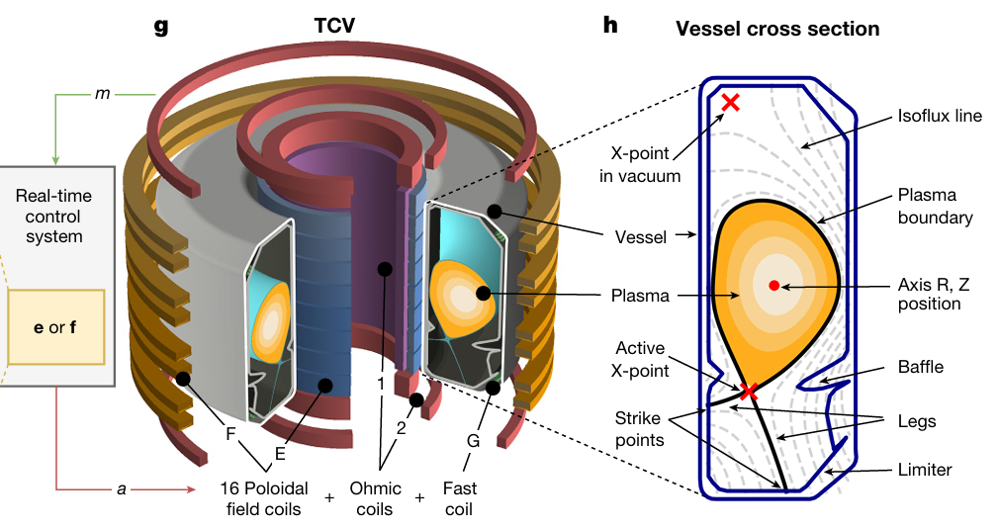

# Pong

In dit leerpad zag je hoe je een worm kon trainen om te kruipen met behulp van versterkend leren. Versterken leren kan in heel wat contexten toegepast worden. Denk terug aan het Pong spelletje uit het vorige leerpad. Ook voor dat spel kunnen we een agent trainen. Die agent zal dan proberen om het spel te spelen. 

Hieronder kan je een agent trainen om het Pong spel te spelen. Pas daarvoor, net als bij de worm, de parameters van het trainingsproces aan tot je een goed resultaat krijgt.

<iframe src="https://dwengo.org/pong" title="Voorbeeld van een convolutie" width="720px" height="800px"></iframe>

<h2 class="title">Versterken leren en kernfusie</h2>

Bij kernfusie moet hete plasma van meer dan 150 miljoen graden Celsius in de lucht gehouden worden met elektromagnetenmagneten. Deze magneten moeten op elk moment het juiste magnetisch veld genereren om de plasma in de lucht te houden. Daarvoor moeten complexe controlesignalen naar de magneten gestuurd worden. Jonas Degrave, onderzoeker bij Google Deepmind en alumnus van het AI en robotica lab van de UGent, ontwikkelde zo'n controlesysteem dat gebruik maakt van versterkend leren1. Zijn werk publiceerde hij in het tijdschrift Nature.

</img>  

1. Degrave, Jonas, et al. "Magnetic control of tokamak plasmas through deep reinforcement learning." Nature 602.7897 (2022): 414-419.>

