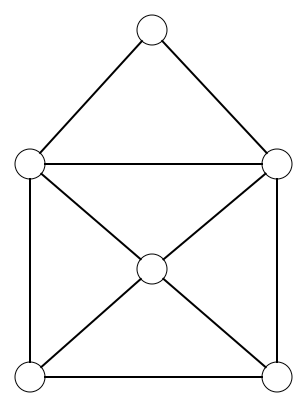
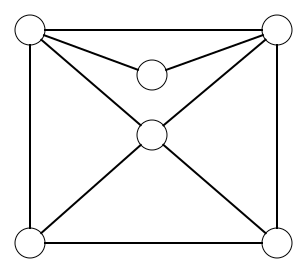
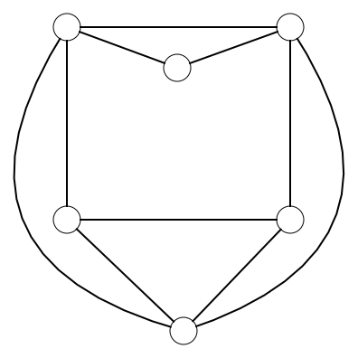
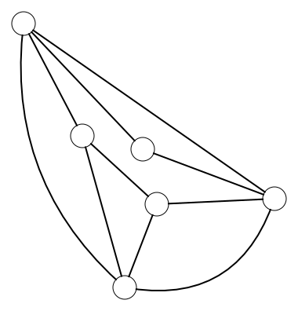

# Grafen

Is het je gelukt? Heb je alle tekeningen kunnen maken zonder je balpen op te heffen? Of is het je bij sommige figuren niet gelukt? Bij veel tekeningen kan het heel moeilijk zijn om een oplossing te vinden door gewoon mogelijkheden uit te proberen. Toch bestaat er een trucje dat je kan helpen om de oplossing gemakkelijker te vinden. Dit trucje komt uit de grafentheorie. 

<h2 class="title">Wat is een graaf?</h2>

Een graaf is een structuur die bestaat uit <strong>knopen</strong> en eventuele verbindingen tussen die knopen, de <strong>bogen</strong>.

Hier zie je een voorbeeld van een graaf met **twee knopen** en **één boog** ertussen.

De tekeningen die we probeerden te maken, kunnen we ook voorstellen als grafen. In de volgende tabel zie je links de tekening en rechts de voorstelling als een graaf.

| Tekening | Graaf |
|-|:-:|
|  |  |
|  |  |
|  |  |
|  |  |

Ons initiële probleem, waarbij we een tekening willen maken zonder onze balpen op te heffen, kunnen we dus vertalen naar een grafenprobleem. Dit probleem formuleren we als volgt. Bestaat er een *wandeling* in de graaf waarbij je elke boog juist een keer oversteekt?

    <h2 class="title">Isomorfie</h2>
    

        In tegenstelling tot onze tekeningen, zijn de posities van de knopen van de graaf niet van belang. Je kan de knopen van de graaf op gelijk welke plaats tekenen zolang ze via bogen verbonden blijven met dezelfde knopen. Deze verschillende versies van de graaf zijn <strong>isomorf</strong>. Hieronder zie je bijvoorbeeld een aantal mogelijke graafvoorstellingen voor het huisje.
        <table>
            <tr><td></img></td></tr>
            <tr><td></img></td></tr>
            <tr><td></img></td></tr>
            <tr><td></img></td></tr>
        </table>
    

<h2 class="title">De Mercedes challenge</h2>

De Mercedes challenge is een puzzel die viraal is gegaan op TikTok. De uitdaging zou gestart zijn in een Mercedes garage in Dubai. Daar stond een groot Mercedes logo op de grond getekend. Bezoekers van de garage werden uitgedaagd om op over alle lijnen van het logo te lopen zonder twee keer over dezelfde lijn te lopen. Wanneer ze daarin slaagden, wonnen ze een auto. 

Ga zelf op zoek naar een filmpje van de <em>Mercedes Challenge</em>. Slaag jij er in om op de correcte manier over de lijnen van het logo te lopen?

**Waarom is het nu nuttig om onze tekeningen voor te stellen als een graaf?**

Een graaf is een abstracte voorstelling die we voor heel wat problemen kunnen gebruiken. Daarom zijn er al heel veel slimme wiskundigen en computerwetenschappers die hebben nagedacht over de eigenschappen van die grafen. Hun kennis kunnen we gebruiken om ons tekenprobleem op te lossen.

Je zou het misschien niet verwachten maar ons tekenprobleem komt sterk overeen met het probleem van de zeven bruggen van Koningsbergen.
