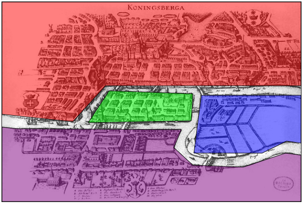
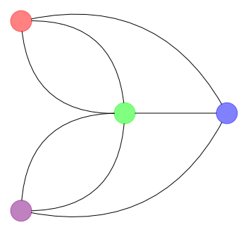

# Graaf van Koningsbergen

Om dit probleem op te lossen, kunnen we eerst een abstractie maken van de kaart van de stad. Er is immers veel informatie op te zien die we niet nodig hebben. Zo moeten we niet weten waar de huizen in de stad liggen of zelfs waar de rivier en de bruggen juist liggen. De enige info die we nodig hebben is welke eilanden er zijn en welke bruggen de eilanden verbinden. De overbodige informatie laten we weg.

We tekenen op de volgende manier een **graaf** van de stad:

1. Teken voor elk eiland van de stad een knoop.
2. Teken voor elke brug tussen twee eilanden een boog tussen de knopen die overeenkomen met deze twee eilanden.

Hieronder zie je de kaart van Konginsbergen waarbij de eilanden elk een eigen kleur gekregen hebben. Daaronder zie je de graaf. De kleur van de knoop komt overeen met de kleur van het eiland.

