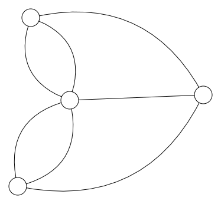
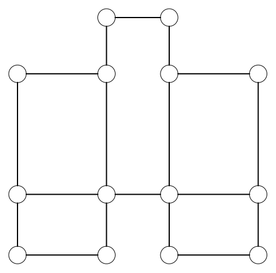

# Euleriaans pad

Leonhard Euler loste het probleem van de bruggen van Koningsbergen op in 1736. Euler stelde dat een *wandeling* in de graaf waarbij je elke boog juist een keer oversteekt enkel mogelijk is als:

 **Elke knoop in de graaf een even aantal bogen heeft of als er juist twee knopen zijn met een oneven aantal bogen**.

Euler baseerde zijn stelling op twee observaties:
1. Als je een graaf hebt waarbij elke knoop een even aantal bogen heeft, kan je nooit vas komen te zitten in een knoop dat niet de knoop is waar je gestart bent. Dit is een rechtstreeks gevolg van het even aantal bogen van elke knoop. Als je toekomt via een boog, is er altijd nog een andere om van te vertrekken. Anders zou het aantal bogen niet even zijn.
2. Als je een graaf hebt met twee knopen met een oneven aantal bogen, moet je uit een van de knopen vertrekken en eindigen in de andere. Voor de andere knopen geldt observatie 1 dus kun je niet vast komen te zitten.

<h2 class="title">Opdracht</h2>

Tel het aantal bogen dat vertrekt uit elke knoop (= de graad van de knoop) van de graaf van Koningsbergen. Is het mogelijk om een Euleriaans pad te vinden in de graaf?

</img>

<h2 class="title">Opdracht</h2>

Kijk terug naar de volgende tekeningen. Welke van deze tekeningen kan je tekenen zonder je balpen op te heffen en welke niet?

<table>
  <tr>
    <th>Image Number</th>
    <th>Image</th>
  </tr>
  <tr>
    <td>1</td>
    <td></td>
  </tr>
  <tr>
    <td>2</td>
    <td></td>
  </tr>
  <tr>
    <td>3</td>
    <td></td>
  </tr>
  <tr>
    <td>4</td>
    <td></td>
  </tr>
</table>

