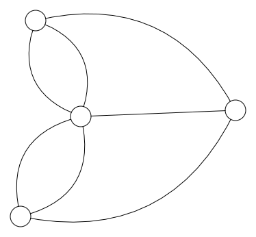
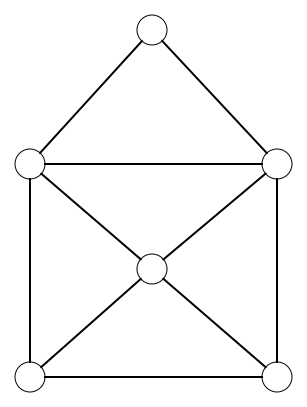
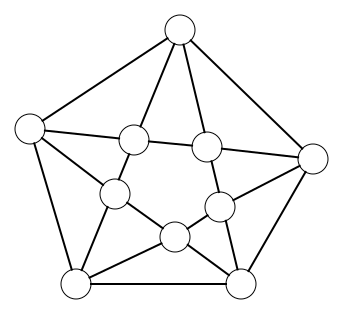
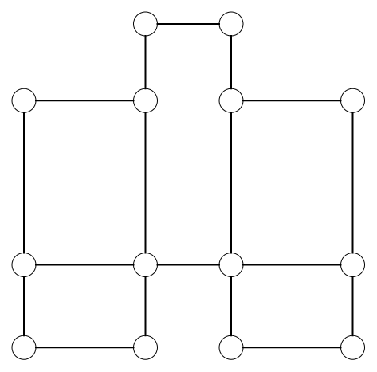

# Euleriaans pad (oplossing)

<h2 class="title">Opdracht</h2>

Tel het aantal bogen dat vertrekt uit elke knoop (= de graad van de knoop) van de graaf van Koningsbergen. Is het mogelijk om een Euleriaans pad te vinden in de graaf?

</img>

<strong>Geen enkele van de knopen heeft een even graad. Het is dus onmogelijk om een Euleriaans pad te vinden in de graaf.</strong>

<h2 class="title">Opdracht</h2>

Kijk terug naar de volgende tekeningen. Welke van deze tekeningen kan je tekenen zonder je balpen op te heffen en welke niet?

<table>
  <tr>
    <th>Image Number</th>
    <th>Image</th>
  </tr>
  <tr>
    <td>1</td>
    <td></td>
  </tr>
  <tr>
    <td colspan=2><strong>Oplossing: </strong>Er zijn twee knopen met een oneven graad. De rest van de knopen heeft een even graad. Bijgevolg is een Euleriaans pad in de graaf mogelijk.</td>
  </tr>
  <tr>
    <td>2</td>
    <td></td>
  </tr>
  <tr>
    <td colspan=2><strong>Oplossing: </strong>Alle knopen in de graaf hebben een even graad. Bijgevolg is een Euleriaans pad in de graaf mogelijk.</td>
  </tr>
  <tr>
    <td>3</td>
    <td></td>
  </tr>
  <tr>
    <td colspan=2><strong>Oplossing: </strong>Alle knopen in de graaf hebben een even graad. Bijgevolg is een Euleriaans pad in de graaf mogelijk.</td>
  </tr>
  <tr>
    <td>4</td>
    <td></td>
  </tr>
  <tr>
    <td colspan=2><strong>Oplossing: </strong>Er zijn meer dan twee knopen in de graaf met een oneven graad. Bijgevolg is een Euleriaans pad in de graaf niet mogelijk.</td>
  </tr>
</table>

