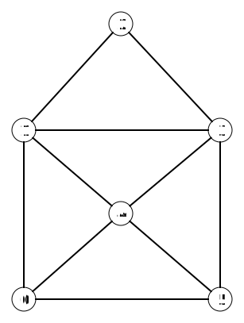

# Een graaf voorstellen met de computer

Er zijn verschillende manieren om een graaf voor de stellen. Eén van die manieren is de adjacentielijst. Hier zie je hoe je zo'n lijst moet opstellen

## De knopen voorstellen

De graaf voor de tekening van het huisje ziet er als volgt uit.

Wij kunnen visueel zien waar elke knoop staat en met welke andere knopen die verbonden is. De computer kan dit echter niet "zien". Daarom moeten we een manier bedenken om naar de knopen en bogen van de graaf te verwijzen. Dat doen we door de knopen een nummer te geven. Hier zie je een voorbeeld van hoe je de knopen van onze graaf kan nummeren. Je kiest zelf welke knoop welk nummer krijgt. Meestal starten we de nummering vanaf 0.

## De bogen voorstellen

Elke knoop heeft nu een nummer. Deze nummers kunnen we gebruiken om ook de bogen van de graaf voor te stellen. Daarvoor gebruiken we een **adjacentielijst**. In deze lijst houden we voor elke knoop bij met welke andere knopen deze verbonden is. Voor elke knoop in onze graaf, voegen we een rij toe aan onze lijst. In die rij noteren we met welke knopen deze knoop verbonden is. Hieronder zie je een voorbeeld van zo een adjacentielijst.
| Nummer van de knoop | Nummers van de knopen waarmee de knoop verbonden is via een boog |
| - | - |
| 0 | 1, 4, 5 |
| 1 | 0, 2, 3, 4 |
| 2 | 1, 3 |
| 3 | 1, 2, 4, 5 |
| 4 | 0, 1, 3, 5 |
| 5 | 0, 3, 4 |

**Opdracht**: Controleer bovenstaande tabel aan de hand van de figuur van de graaf. Kijk voor elke knoop in de linker kolom met welke knopen deze verbonden is. Komt dat overeen met wat je in de tabel ziet staan?

