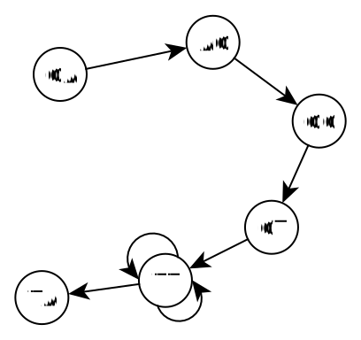

# De "De Bruijn"-graaf

Om de volledige DNA streng te reproduceren op basis van de stukjes DNA die het resultaat zijn van shotgun sequencing, kan je gebruik maken van een De Bruijn graaf. 

Voor we deze graaf opstellen, zetten we onze stukjes DNA eerst om naar een lijst van overlappende **k-meren**. Een **k-meer** is een stukje DNA van k nucleotiden lang? Is k bijvoorbeeld 3 dan maken we een lijst met stukjes DNA van 3 nucleotiden lang (3-meren).

Nemen we bijvoorbeeld de sequentie GAGCTTTTAG, dan kunnen we deze omzetten naar 7 overlappende 3-meren: GAG, AGC, GCT, CTT, TTT, TTT, TTA en TAG. 

Op basis van deze k-meren bouwen we de De Bruijn graaf. Daarvoor nemen we elke k-meer. Voegen we de prefix van lengte k-1 toe als knoop aan de graaf. Voegen we de suffix van lengte k-1 toe als knoop aan de graaf. En verbinden die met een boog.

Voor GAG levert dat de volgende graaf op.

Zo voegen we elke k-meer toe aan de graaf. 

AGC

GCT

CTT

TTT

TTT

TTA

TAG

We voegen niet enkel de k-meren voor deze ene subsequentie (GAGCTTTTAG) toe maar ook voor alle andere subsequenties die we gelezen hebben met shotgun sequencing. Door voldoende stukjes DNA toe te voegen aan de graaf, krijg je een graaf die de structuur van het volledige genoom voorstelt. De volledige DNA sequentie van dat genoom kan je dan vinden door het euleriaans pad te zoeken in die graaf.

