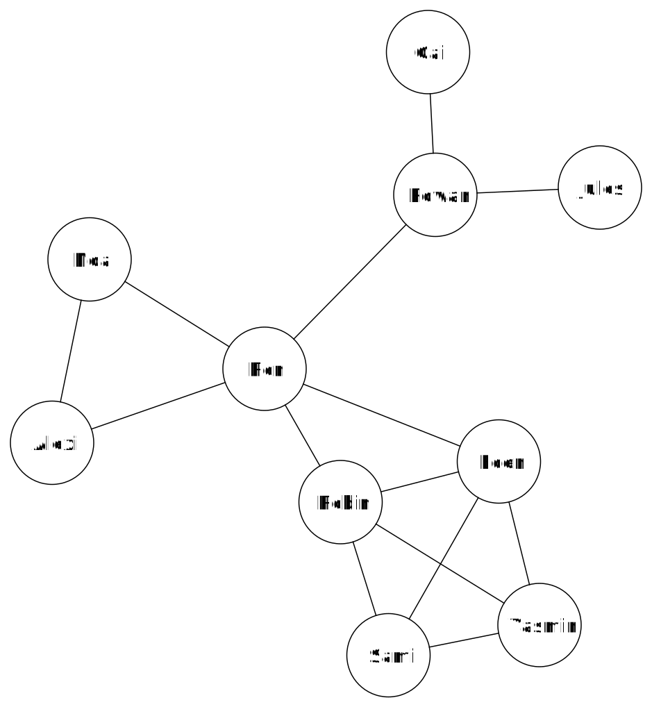

# Sociale netwerken

We delen heel wat van onze persoonlijke informatie op sociale netwerken. Je staat er misschien niet bij stil maar de eigenaars van deze sociale netwerken gebruiken deze informatie om geld te verdienen. Dat kan bijvoorbeeld door jou gepersonaliseerde advertenties te laten zien of door inzichten over de gebruikers te verkopen aan andere bedrijven. Om de informatie van hun gebruikers te analyseren, gebruiken socialmedia-platformen verschillende data-analyse technieken. Deze technieken zoeken bijvoorbeeld naar vriendengroepen of identificeren welke personen veel invloed hebben binnen het netwerk.  

## De sociale graaf

Een sociale graaf of *social graph* is een manier om gegevens van de gebruikers in een sociaal netwerk voor te stellen. Elke knoop in zo een graaf stelt een persoon voor. Tussen twee knopen is er een verbinding (een boog) als die twee personen bevriend zijn met elkaar. Hieronder zie je een voorbeeld van zo'n sociale graaf.

In de rest van deze activiteit zie je hoe je dingen kan leren uit deze graaf.

<h2 class="title">Opdracht</h2>

Probeer de volgende vragen te beantwoorden.
<ul>
<li>Welke vriendengroepen kan je halen uit de graaf?</li>
<li>Welke personen in dit netwerk hebben veel invloed? Iemand is invloedrijk wanneer hun posts door veel mensen gelezen kunnen worden.</li>
<li>Welke personen zijn het verst van elkaar verwijderd? </li>
</ul>

<h2 class="title">Ongesuperviseerd leren</h2>

Ongesuperviseerd of <em>unsupervised</em> leren is een AI-techniek waarmee computerwetenschappers nieuwe informatie uit gegevens proberen halen. Bijvoorbeeld, vriendengroepen zoeken in een sociale graaf. In tegenstelling tot gesuperviseerd (<em>supervised</em>) leren werkt ongesuperviseerd leren niet op basis van gelabelde voorbeelden. Je hebt dus geen trainingsverzameling om een model te trainen.  

