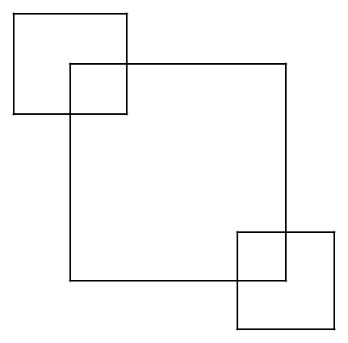

# Tekenen maar!

Ja, deze activiteit start met een opdracht! 
- Neem een blaadje papier en een balpen. 
- Probeer de volgende figuren na te tekenen zonder je pen op te heffen.
- Elke lijn mag je maar één keer tekenen, je mag dus geen tweede keer met je pen over dezelfde lijn gaan.

|  |  |
|-|:-:|
| 1 |  |
| 2 |  |
| 3 |  |
| 4 |  |

**Tip:** Denk na over op welke punten je al dan niet moet starten om de tekening te kunnen maken.

**Tip:** De oplossing willen vinden kan verslavend zijn. Heb je na 15 minuten nog niet alle oplossingen gevonden, ga dan verder met het leerpad.

