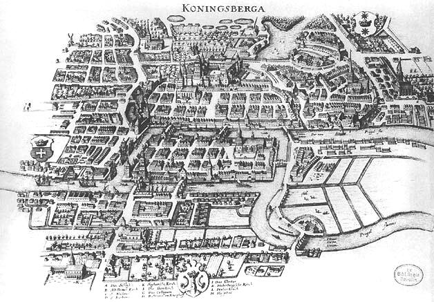

# De zeven bruggen van Koningsbergen

De stad Koningsbergen (tegenwoordig Kaliningrad) was deel van het Pruisische rijk. Door Koningsbergen loopt de Pregel, een rivier met verschillende armen die de stad in eilanden verdeelt. Hieronder zie je een afbeelding van Koningsbergen in 1652 die toont hoe de rivier loopt.

