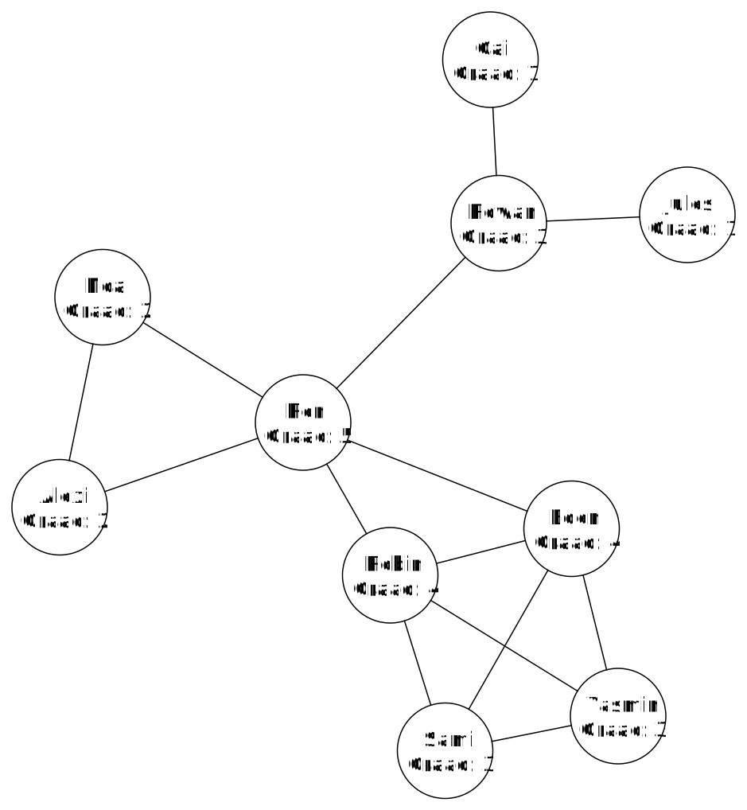

# Influencers

Er zijn verschillende maten om te bepalen wie er meer of minder invloed heeft binnen het sociale netwerk. Een eenvoudige methode is om te kijken naar het aantal connecties met anderen die een persoon heeft. Heeft die veel connecties, is die invloedrijker. 

## Graadcentraliteit

Hoeveel invloed een persoon heeft in een netwerk noemen we de *centraliteit*. Het woord verwijst naar hoe "centraal" een persoon staat binnen het netwerk. Er bestaan verschillenden manieren om de centraliteit te bepalen. Eén van die manieren is de **graadcentraliteit**. De graadcentraliteit van een knoop is gelijk aan het aantal bogen die uit die knoop vertrekt (de graad van die knoop). Hieronder zie je voor elke knoop in ons sociale netwerkje wat de graad van die knoop is.

Willen we weten wie het meeste invloed heeft binnen ons sociaal netwerk, dan kijken we welke knoop de hoogste graad heeft. In dit geval is dat Ren. Komt dit overeen met jou idee van wie de meest invloedrijke persoon is binnen het netwerk?

<h2 class="title">Eigenwaardecentraliteit</h2>

Naast graadcentraliteit zijn er nog heel wat andere manieren om de centraliteit van een persoon te bepalen. Eén zo'n manier is eigenwaardencentraliteit. Eigenwaardecentraliteit kijkt niet enkel naar hoeveel connecties een persoon heeft maar ook hoe waardevol deze connecties zijn. Als je bevriend bent met mensen die zelf veel vrienden hebben zal je immers meer invloed hebben dan wanneer je bevriend bent met "onpopulaire" mensen met weinig vrienden.

Je eigen invloed hangt in dit geval af van de invloed van de personen waarmee je verbonden bent. Let wel, de invloed van de personen waarmee je verbonden bent hangt ook af van je eigen invloed. Dit is een voorbeeld van een eigenwaardenprobleem. Heel wat problemen vallen onder de categorie van eigenwaardenproblemen. Denk bijvoorbeeld aan Google PageRank. Dit is het algoritme van Google die websites op het internet rangschikt volgens hun belang. 

