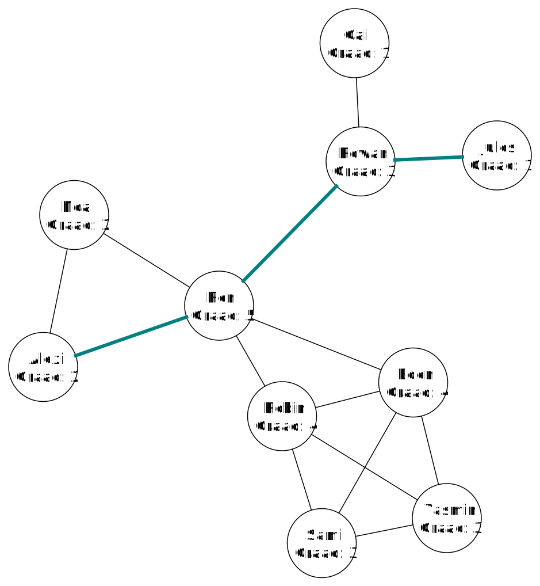

# De maximale afstand tussen twee willekeurige personen

De maximale afstand tussen twee willekeurige personen in het netwerk geeft ons informatie over hoe "uitgespreid" het netwerk is. Een netwerk met veel knopen maar een korte maximale afstand zal sterk samenhangend zijn. Een netwerk met weinig knopen maar een grote maximale afstand is minder samenhangend. Delen van een netwerk die sterk samenhangend zijn komen vaak overeen met vriendengroepen.

## De minimale afstand tussen twee personen

Om de maximale afstand te vinden tussen twee willekeurig personen, moeten we eerst de minimale afstand zoeken tussen elk paar personen in het netwerk. Hieronder zie je het minimale pad tussen Alexi en Jules. Op dit pad liggen 3 bogen. De minimale afstand is dus 3.

We zoeken deze afstand tussen elk paar personen in het netwerk. Er zijn 10 personen en elk van deze 10 personen kan met 9 andere personen verbonden zijn. Er zijn dus 90 mogelijke paren. Aangezien de minimale afstand tussen het paar (persoon1, persoon2) en (persoon2, persoon1) gelijk is, moeten we de afstand tussen maar 45 paren bepalen. 

## Het algoritme van Dijkstra

Om de minimale afstand tussen twee knopen in een graaf te bepalen kunnen we het **algoritme van Dijkstra** gebruiken. Dit algoritme wordt bijvoorbeeld ook gebruikt in een routeplanner om de kortste weg tussen twee plaatsten te bepalen.

