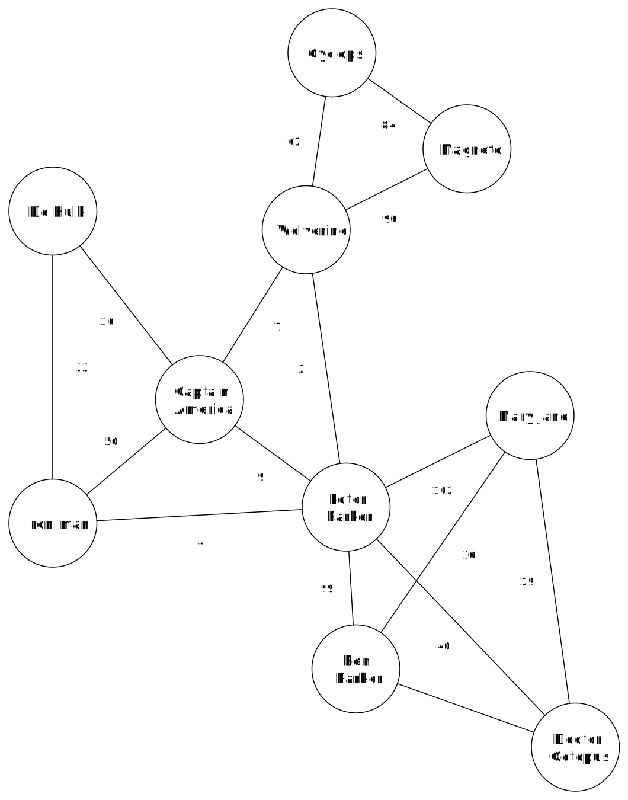

# Het super sociaal netwerk

In de volgende notebook verken je zelf een "super" sociaal netwerk. Het netwerk bevat immers een overzicht van alle superhelden die ooit deel uitgemaakt hebben van een Marvel strip. In het netwerk is er een link tussen twee personages wanneer die samen in een strip voorgekomen zijn. Komen die personages in meerdere strips samen voor, dan krijgt die link een sterker gewicht. Hieronder zie je een voorbeeld van hoe een eenvoudige versie van het super sociaal netwerk eruit zou kunnen zien.

In de knopen van deze graaf staan de superhelden. Wanneer er een boog tussen twee helden staat, komen die één of meerdere keren samen voor in een strip. Het getal naast de boog geeft weer in hoeveel strips ze samen voorkomen. 